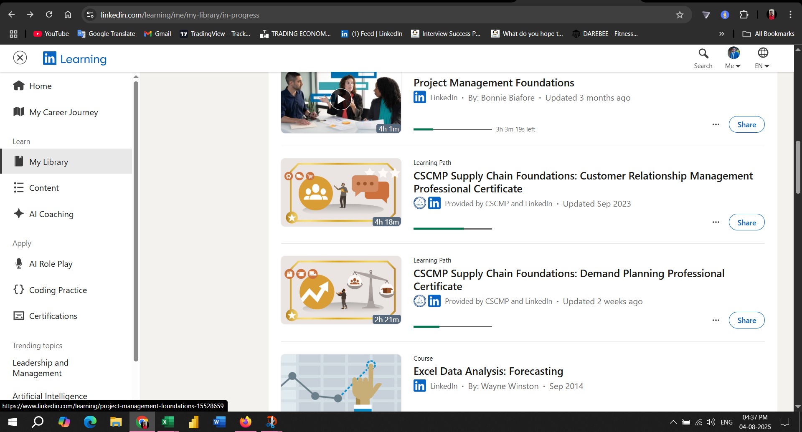

# Certifications In Progress

I'm actively upskilling through LinkedIn Learning and CSCMP-accredited programs in customer relationship management, demand planning, forecasting, and reporting.

---

## Overview of Certifications

This includes:
- CSCMP Customer Relationship Management (85% complete)
- Demand Planning Professional Certificate (60% complete)
- Excel Data Analysis: Forecasting
- Sales Reporting & Power BI (In Progress)

---

These certifications represent real-time commitment to building expertise in digital supply chain operations, analytics, and vendor engagement.
